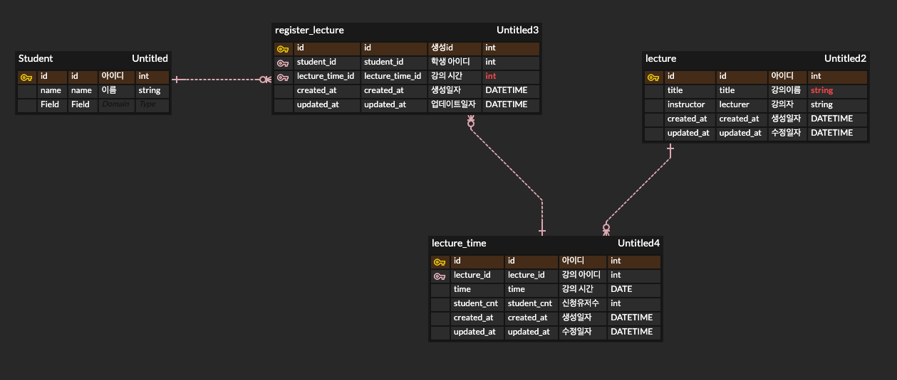

# 요구사항

## ERD 구조 및 설명

참조 사항 : https://www.erdcloud.com/d/QSsaG2tG7C8LCkw5k

우선 유저에 해당되는 `User Table` 을 만들어야하는데 시스템에 대한 유저 정의가 없어서  
추후 변경을 고려하여 `Student Table` 을 만들었습니다.  
`Student Table` 의 필수 항목은 이름만 추가하였습니다.

이후 서비스의 메인인 `Lecture Table` 을 생성했습니다.
필수 조건인 강연자, 특강 제목 만 추가했습니다.

강좌 시간의 경우 주어진 요구사항에서 정확하게 정해진 점은 없어서    
임의로 하나의 강의는 여러 시간을 갖을 수 있다고 생각하였고    
`Lecture Table` 을 `ManyToOne` 으로 연결했습니다.(논리적 관계도만 연결)  
각 시간마다 신청인원을 다를 것이라 생각하여 신청 인원수인 `StudentCnt` 를 추가했습니다.  
시간을 뜻하는 `Time` 컬럼도 추가했습니다.

학생들 마다 신청하는 테이블은 `Register_lecture Table` 입니다.  
시간을 선택했기 때문에 해당 `Lecture Table` 이 아니라 `LectureTime Table` 의 `id` 를 `OneToOne` 으로 참조하였습니다.    
학생의 정보도 알아야히기 하기 때문에 학생 `id` 를 `OneToOne` 으로 참조하였습니다.

강좌별 시간을 나타내는 `LectureTime Table` 을 생성했습니다.
